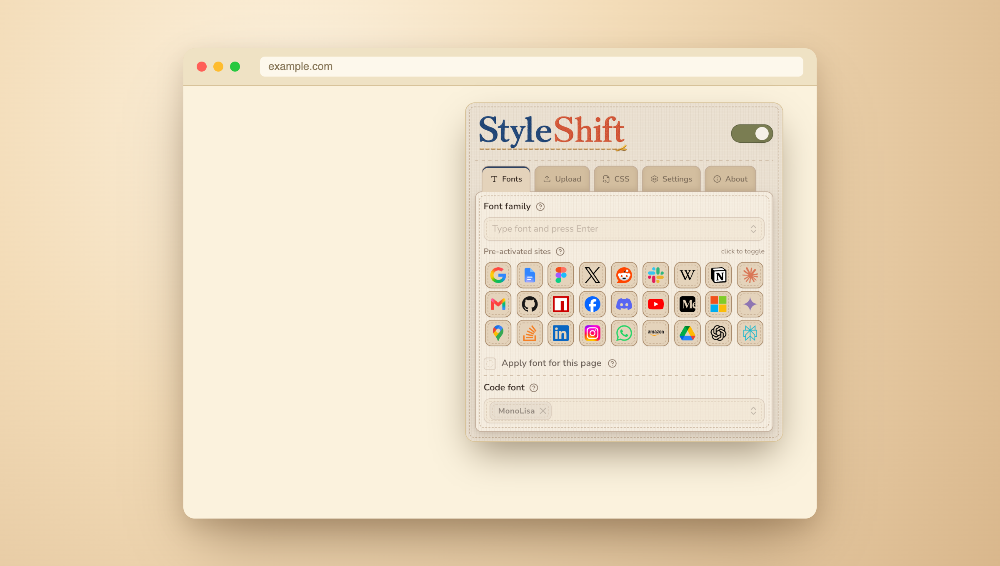

<div align="center">
  
</div>

<hr />

<div align="center">

[](LICENSE)
[](public/manifest.json)
[](package.json)
[](vite.config.ts)

</div>

**StyleShift** is a Chrome extension that lets you customize fonts and CSS on any website. Pick a bundled font, upload your own, or import from Google Fonts — apply it globally or per site, and it sticks around on every visit.

## Features

- **Font injection** 🔤 — bundled fonts, custom uploads, or Google Fonts, applied per site or globally.
- **One-click site shortcuts** ⚡ — pre-activated toggles for popular sites, ready to enable in one click.
- **Code font** 🖋️ — set a separate monospace font for code blocks.
- **Custom CSS editor** 🎨 — write, format, and apply raw CSS per site, with save/remove/reset/copy actions.
- **Persistent, per-hostname settings** 💾 — everything is stored in `chrome.storage.local` and re-applied automatically on page load/navigation.
- **Global toggle** — enable or disable StyleShift for the current site straight from the popup header.
- **Localized UI** 🌍 — popup is translated (English, Spanish, Arabic, Chinese, Persian, and more — see `src/shared/i18n`).

## Quick Start

```bash
npm install
npm run build
```

Then load the extension in Chrome:

1. Open `chrome://extensions`.
2. Enable **Developer mode** (top right).
3. Click **Load unpacked** and select the `dist/` folder.
4. Pin StyleShift and click its icon on any site to start customizing fonts and CSS.

## Tech Stack

- **React + TypeScript + Vite** — popup, settings, and editor pages.
- **Chrome Extension Manifest V3** — `activeTab`, `scripting`, `storage`, `unlimitedStorage` permissions, `<all_urls>` host permission.
- **Tailwind CSS** — UI styling.
- **Vitest** — unit tests.

## Project Structure

```
src/
  popup/          Popup UI — font picker, pre-activated sites, code font
  css-editor/      Standalone CSS editor page
  font-manager/    Font upload & management page
  settings/        Extension settings page
  content/         Content script — reads storage, injects font/CSS on load
  background/      Service worker — triggers re-injection on tab navigation
  shared/          Storage schema, injection logic, font catalogs, i18n
scripts/build-extension.mjs   Build step for the content script & service worker
public/manifest.json          Extension manifest
```

## Development

```bash
npm run dev      # Vite dev server for the popup/editor/settings pages
npm run build    # Production build -> dist/
npm run package  # Build + zip an upload-ready release/styleshift.zip
npm run test     # Run unit tests with Vitest
npm run lint     # ESLint
npm run format   # Prettier
```

See [PRIVACY.md](PRIVACY.md) for the privacy policy (no data leaves your device
except optional Google Fonts imports using your own API key).

## Storage Schema

Settings are stored in `chrome.storage.local`, keyed by hostname:

```json
{
  "example.com": {
    "fontFamily": "'Roboto', sans-serif",
    "fontEnabled": true,
    "customCSS": "body { background: #000; }"
  }
}
```

## Contributing

Issues and pull requests are welcome — bug fixes, new pre-activated sites, translations, or general cleanup.

## Author

**Amir Meimari** — [amirmeimari@gmail.com](mailto:amirmeimari@gmail.com)

## License

Distributed under the MIT License. See [LICENSE](LICENSE) for more information.
